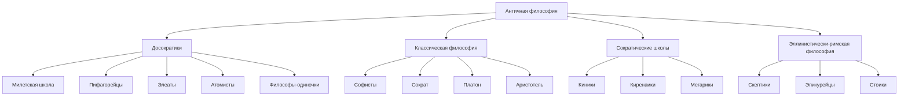

# Лекция 3. Античная философия

## 1. Общая идея

Античная философия - это попытка объяснить мир как упорядоченный космос.

Ее главный вопрос сначала был такой: `из чего все возникло?`

## 2. Периоды

- протофилософия / досократики;
- классика;
- эллинизм и римский период;
- упадок в эпоху Римской империи.

## 3. Схема школ

## 4. Досократики: что они искали

Они искали `первоначало` - основу всего.

Общие черты:

- космоцентризм;
- интерес к природе;
- материальные объяснения;
- стремление понять, из чего все состоит.

### Милетская школа

#### Фалес

Самое памятное:

- все произошло из воды;
- Земля - плоский диск, плавающий на воде;
- он первым удачно предсказал солнечное затмение;
- сделал важные математические открытия.

Это один из самых удобных для запоминания примеров: `Земля = плоскость в океане`.

#### Анаксимандр

- первоначало - `апейрон`, неопределенное и беспредельное;
- миры возникают и гибнут;
- жизнь зародилась в воде и иле;
- люди, по его версии, произошли от рыбоподобных существ.

#### Анаксимен

- первоначало - воздух;
- сгущение и разрежение объясняют все превращения;
- воздух связан с жизнью.

### Пифагорейцы

Их идея: `число - основа мира`.

Это уже шаг от физической стихии к абстрактной структуре.

### Элеаты

#### Ксенофан

- критиковал антропоморфных богов;
- был монотеистически настроен;
- говорил, что человеку доступно не полное знание, а только мнение.

#### Парменид

Самая жесткая формула:

- бытие есть;
- небытия нет.

Он почти выключает изменение: если мыслить строго, то мир должен быть единым и неизменным.

#### Зенон

Знаменит апориями.

Что они доказывают?

- движение трудно помыслить;
- множество и пустота тоже проблемны.

Самые известные апории: `Ахилл`, `Дихотомия`, `Стрела`.

### Гераклит

Противоположность элеатам.

Что запомнить:

- все течет;
- мир находится в постоянном изменении;
- борьба противоположностей - источник развития;
- первооснова - огонь;
- Логос - мировой разум.

Это философия процесса, а не статики.

### Эмпедокл

- четыре стихии: земля, вода, воздух, огонь;
- две силы: Любовь и Вражда.

Очень удобная схема: стихии - это `компоненты`, а Любовь и Вражда - `механизмы сборки и распада`.

### Анаксагор

- вводит `Нус`, ум, который упорядочивает хаос;
- светила - не боги, а материальные тела.

### Атомисты

#### Левкипп и Демокрит

Основное:

- все состоит из атомов и пустоты;
- атомы неделимы;
- атомы различаются по форме и размеру;
- все находится в движении;
- вещи возникают и распадаются.

Демокрит - один из главных материалистов античности.

## 5. Софисты

Софисты - учителя риторики и спора.

Их главная идея: истина и нормы относительны.

### Протагор

Формула, которую надо помнить:

`Человек есть мера всех вещей`.

### Горгий

Его радикальная позиция:

- ничего не существует;
- если что-то существует, это нельзя познать;
- если и можно познать, нельзя передать.

Софисты важны тем, что они вывели философию к человеку, языку и спору.

## 6. Сократ

Главный поворот: философия переходит от природы к человеку.

### Метод

- ирония;
- майевтика.

### Идея

- знание связано с добродетелью;
- зло происходит от незнания.

### Добродетели

- умеренность;
- храбрость;
- справедливость.

## 7. Платон

### Главное

Есть два мира:

- мир идей;
- мир вещей.

Идеи вечны, а вещи - только их тени.

### Образ пещеры

Люди видят тени и думают, что это и есть реальность.

### Душа

Душа бессмертна и состоит из:

- разумного;
- волевого;
- вожделеющего начала.

### Государство

Платон мыслит идеальное государство по аналогии с душой: каждый должен делать свое дело.

## 8. Аристотель

Аристотель - систематизатор.

### Важное

- критиковал Платона;
- выделил четыре причины:
  - материальную;
  - производящую;
  - формальную;
  - целевую;
- создал формальную логику;
- сформулировал законы тождества, непротиворечия и исключенного третьего.

### Силлогизм

Классический пример:

- все люди смертны;
- Сократ - человек;
- значит, Сократ смертен.

## 9. Сократические школы

### Киники

- аскетизм;
- отказ от внешних благ;
- свобода от условностей.

### Киренаики

- высшее благо - наслаждение.

### Мегарики

- любят споры о понятиях и благе.

## 10. Поздняя античность

### Скептики

- надо воздерживаться от окончательных суждений;
- цель - душевный покой.

### Эпикурейцы

- мир состоит из атомов и пустоты;
- цель жизни - счастье как отсутствие страдания.

### Стоики

- жить по природе и Логосу;
- добродетель - главное;
- внутреннее спокойствие важнее внешних обстоятельств.

## 11. Что обычно легче всего запомнить

- Фалес - вода и плоская Земля на воде;
- Анаксимандр - апейрон;
- Анаксимен - воздух;
- Пифагор - число;
- Гераклит - все течет;
- Парменид - бытие есть, небытия нет;
- Демокрит - атомы;
- Протагор - человек мера;
- Сократ - знание и добродетель;
- Платон - мир идей;
- Аристотель - логика и причины.
