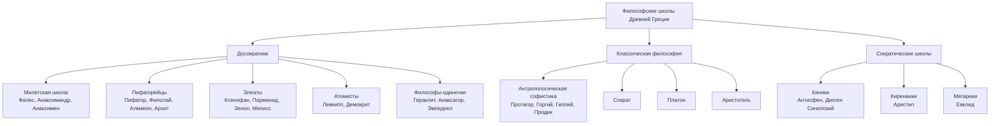

# Лекция 3. Античная философия

## 1. Общая характеристика

Античная философия существовала более тысячи лет - от VI века до н. э. до VI века н. э. Она прошла путь от возникновения к расцвету, затем к упадку и гибели.

Основная черта античной философии - космоцентризм: мир мыслится как упорядоченный космос, а человек понимается как часть этого космоса.

## 2. Периоды античной философии

Выделяются четыре периода:

- протофилософия, или досократический этап;
- классический период;
- эллинистический и римский закат;
- период упадка в эпоху Римской империи.

## 3. Досократики

Досократические школы стремились объяснить природу, найти первоначало всего сущего и описать мир через материальные основания.

Общие черты:

- космоцентризм;
- интерес к природе;
- поиск первоначала;
- гилозоизм;
- недискуссионный характер учений.

### Милетская школа

Представители: Фалес, Анаксимандр, Анаксимен.

Они искали природное первоначало:

- Фалес - вода;
- Анаксимандр - апейрон, беспредельное начало;
- Анаксимен - воздух.

Эта школа положила начало натурфилософии и рациональному объяснению природы.

### Пифагорейцы

Пифагор и его школа сделали число основой мироздания. Мир мыслится как гармония числовых отношений. Пифагорейцы также развивали идеи переселения душ и строгий образ жизни.

### Элеаты

Ксенофан, Парменид, Зенон и Мелисс сделали акцент на бытии и мышлении.

- Ксенофан - первый монотеист и скептик.
- Парменид утверждал: бытие есть, небытия нет.
- Зенон создал апории, доказывающие трудность мысли о движении и множественности.

Элеаты противопоставили чувственное мнение истинному рациональному знанию.

### Гераклит

Гераклит учил, что все находится в постоянном изменении.

Главные идеи:

- первоначало - огонь;
- все течет;
- борьба противоположностей - источник развития;
- Логос - мировой разум.

### Эмпедокл

Эмпедокл говорил о четырех стихиях: земле, воде, воздухе и огне.

Движение мира объясняется борьбой двух сил:

- Любви, соединяющей;
- Вражды, разъединяющей.

### Анаксагор

Анаксагор ввел понятие `Нус` - ум, который упорядочивает хаотическую материю.

Он считал, что небесные светила - не божества, а материальные тела.

### Атомисты

Левкипп и Демокрит утверждали, что все состоит из атомов и пустоты. Атомы вечны, неделимы, находятся в постоянном движении и различаются по форме и величине.

## 4. Софисты

Софисты были учителями риторики, логики и искусства спора. Они первыми поставили человека в центр философии.

Главная идея Протагора: `человек есть мера всех вещей`.

Софисты подчеркивали относительность знаний, норм и оценок, развивали релятивизм и скепсис.

Их вклад:

- критика догматизма;
- развитие риторики;
- внимание к человеку и обществу.

## 5. Сократ

Сократ выступил против релятивизма софистов и утверждал существование общезначимой истины.

Его метод:

- ирония;
- майевтика, то есть помощь собеседнику в самостоятельном рождении истины.

Сократ считал, что знание связано с добродетелью: зло совершается от незнания.

Основные добродетели:

- умеренность;
- храбрость;
- справедливость.

## 6. Платон

Платон создал учение о двух мирах:

- мире идей;
- мире вещей.

Идеи вечны, а вещи - лишь их тени. Высшая идея - Благо.

Знаменитый образ пещеры показывает, что большинство людей живут среди иллюзий, принимая тени за реальность.

Душа человека бессмертна и состоит из трех частей:

- разумной;
- волевой;
- вожделеющей.

Идеальное государство должно соответствовать структуре души.

## 7. Аристотель

Аристотель систематизировал философию и науки, критиковал Платона и разработал учение о четырех причинах:

- материальной;
- производящей;
- формальной;
- целевой.

Он создал формальную логику и сформулировал ее основные законы:

- тождества;
- непротиворечия;
- исключенного третьего.

Главная форма логического вывода у него - силлогизм.

## 8. Сократические школы

### Киники

Киники проповедовали освобождение от внешних благ, аскетизм, независимость и презрение к условностям. Их идеал - простая и свободная жизнь вне социальных привязанностей.

### Киренаики

Киренаики считали высшим благом наслаждение и связывали цель жизни с удовольствием.

### Мегарики

Мегарская школа занималась логическими и спорными вопросами, стремясь определить высшее благо и природу понятий.

## 9. Эллинистически-римская философия

### Скептики

Скептики учили воздерживаться от окончательных суждений. Их цель - душевное спокойствие.

Пиррон утверждал, что вещи не имеют определенной сущности, а потому следует не утверждать и не отрицать.

### Эпикурейцы

Эпикурейцы учили, что мир состоит из атомов и пустоты, а цель жизни человека - счастье, понимаемое как отсутствие страданий и душевная безмятежность.

### Стоики

Стоики стремились к внутренней свободе через самодисциплину и жизнь в согласии с природой и Логосом. Добродетель для них - высшее благо.

В позднем стоицизме особенно известны Сенека и Марк Аврелий.

## 10. Дополнительные акценты

Античную философию удобно запоминать как движение от `первоначала мира` к `человеку` и затем к `искусству жить`.

Последовательность тоже важна:

- досократики спрашивают, из чего мир;
- софисты спрашивают, как говорить и как жить среди людей;
- Сократ переводит вопрос внутрь человека;
- Платон строит модель идеального мира;
- Аристотель систематизирует знание;
- эллинистические школы учат, как сохранить душевное равновесие.

Если упростить до программистской аналогии, досократики ищут `source code` Вселенной, Сократ ищет `behavioral rules` человека, Платон описывает `идеальный backend` реальности, а стоики и эпикурейцы уже решают, как жить в `production` без постоянных ошибок.

## 11. Схема школ Древней Греции

## Термины и аналогии

- `космоцентризм` - взгляд, где в центре космос; как если бы главным был `кластер`, а не отдельный сервис.
- `гилозоизм` - идея, что материя живая; как если бы у всех объектов был свой `runtime`.
- `апория` - логическое затруднение; как `edge case`, который ломает красивую схему.
- `логос` - мировой разум и закон; как общий `protocol`, связывающий все процессы.
- `эйдос` - идея, сущность вещи; как `interface` или `schema` для объектов.
- `релятивизм` - все относительно; как разные `environments` дают разные результаты.
- `атараксия` - невозмутимость; как состояние, когда продакшен спокоен.
- `силлогизм` - вывод из двух посылок; как маленький `proof`, где A и B ведут к C.
