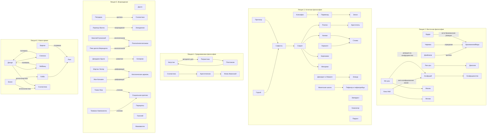

# Большая схема философов по лекциям 1-6

Лекция 1 - вводная, в ней нет отдельных философов как центральных фигур, только общая теория философии.

## Карта влияний

## Таблица философов

| Лекция | Философ / школа | На кого опирался | Что нового добавил |
|---|---|---|---|
| 2 | Конфуций | Древняя традиция, ритуал, семейная иерархия | Идеал `цзюнь-цзы`, золотая середина, этика как основа государства |
| 2 | Лао-цзы | Китайская натурфилософия, культ Неба | Учение о Дао, `у-вэй`, естественная гармония |
| 2 | Мо-цзы | Отталкивался от конфуцианства | Всеобщая любовь, взаимная польза, утилитарный подход |
| 2 | Хань Фэй | Легистская линия управления | Жесткий приоритет закона, наград и наказаний |
| 2 | Будда | Антибрахманская реакция на ритуал и социальное неравенство | Четыре благородные истины и восьмеричный путь |
| 2 | Чарвака | Полемика с Ведами и жречеством | Последовательный материализм и опора только на восприятие |
| 2 | Джайнизм | Критика брахманизма, но сохранение кармы | Ненасилие, аскетизм, множественность аспектов истины |
| 2 | Даосизм | Древняя натурфилософия Китая | Дао как закон мира и принцип недеяния |
| 2 | Конфуцианство | Традиция, ритуал, семейная мораль | Нравственный идеал благородного мужа |
| 2 | Моизм | Реакция на конфуцианство | Всеобщая любовь + практическая польза |
| 2 | Легизм | Социальная практика управления | Государство как машина закона и наказания |
| 3 | Фалес | Мифологические представления о природе | Вода как первоначало, натурфилософский подход |
| 3 | Анаксимандр | Фалес | Апейрон как беспредельное начало, идея бесконечных миров |
| 3 | Анаксимен | Анаксимандр | Воздух как первоначало, объяснение через сгущение и разрежение |
| 3 | Пифагор | Математика и религиозно-мистические представления | Число как основа мироздания |
| 3 | Ксенофан | Критика антропоморфных богов | Монотеистическая тенденция и скепсис к знанию |
| 3 | Парменид | Ксенофан | Бытие едино, неизменно, небытия нет |
| 3 | Зенон | Парменид | Апории, защита единства бытия и критика движения |
| 3 | Гераклит | Наблюдение изменчивости мира | Диалектика, борьба противоположностей, Логос |
| 3 | Эмпедокл | Пифагорейско-элеатская традиция, натурфилософия | Четыре стихии и две силы: Любовь и Вражда |
| 3 | Анаксагор | Досократическая натурфилософия | `Нус` как упорядочивающий ум |
| 3 | Левкипп | Поиск материального объяснения мира | Атомизм |
| 3 | Демокрит | Левкипп | Развитие атомизма, материализм, этика умеренности |
| 3 | Софисты | Потребности полиса и риторики | Релятивизм, анализ языка, человек как мера |
| 3 | Протагор | Софистическая традиция | Субъективный критерий истины |
| 3 | Горгий | Элеаты и риторика | Радикальный скепсис и теория речевого воздействия |
| 3 | Сократ | Реакция на софистов | Майевтика, этический реализм, знание как добродетель |
| 3 | Платон | Сократ, элеаты, пифагорейцы | Теория идей, мир пещеры, бессмертие души |
| 3 | Аристотель | Платон, предшествующая наука | Учение о четырех причинах, формальная логика |
| 3 | Киники | Сократ через Антисфена | Аскетизм и отказ от внешних благ |
| 3 | Киренаики | Сократ через Аристиппа | Наслаждение как высшее благо |
| 3 | Мегарики | Сократ | Логические споры о благе и понятиях |
| 3 | Пиррон | Восточные аскеты, индийские впечатления | Скепсис как путь к спокойствию |
| 3 | Эпикур | Демокрит | Атомизм + этика счастья как отсутствия страдания |
| 3 | Стоики | Киники, частично Гераклит | Жизнь по природе и Логосу, апатия |
| 4 | Августин | Платон, неоплатонизм, христианство | Благодать, теодицея, психологическое время, два града |
| 4 | Фома Аквинский | Аристотель, христианская теология | Синтез веры и разума, 5 доказательств Бога, теория закона |
| 5 | Данте | Христианство, античность | Единство божественного и человеческого, человек как разумное творение |
| 5 | Петрарка | Античная культура, критика схоластики | Гуманизм, ценность внутренней жизни, искусство жить |
| 5 | Лоренцо Валла | Эпикур | Гедонизм и естественность как критерий жизни |
| 5 | Николай Кузанский | Неоплатонизм, христианская традиция | Совпадение противоположностей, единство Бога и мира |
| 5 | Пико делла Мирандола | Неоплатонизм | Достоинство человека и свобода самоопределения |
| 5 | Коперник | Астрономические наблюдения | Гелиоцентризм |
| 5 | Джордано Бруно | Коперник, натурфилософия | Бесконечная Вселенная, множество миров |
| 5 | Лютер | Библия, критика католической церкви | Личная вера без посредников, упрощение церковной жизни |
| 5 | Кальвин | Реформация | Дисциплинированная протестантская этика |
| 5 | Макиавелли | Политическая практика, наблюдение за людьми | Политика как автономная сфера, реализм власти |
| 5 | Томас Мор | Социальная критика Возрождения | `Утопия`, общественная собственность, равный труд |
| 5 | Кампанелла | Утопический гуманизм | `Город Солнца`, тотальная организация общества |
| 6 | Бэкон | Борьба со схоластикой | Индукция, таблицы исследования, учение об идолах |
| 6 | Гоббс | Бэкон, сенсуализм | Общественный договор, война всех против всех, сильное государство |
| 6 | Локк | Эмпиризм, критика врожденных идей | `tabula rasa`, опыт как источник знаний, естественные права |
| 6 | Декарт | Математика, методическое сомнение | `Cogito`, рациональный метод, дуализм субстанций |
| 6 | Спиноза | Декарт | Монизм, Бог = природа, свобода как познанная необходимость |
| 6 | Лейбниц | Полемика с Декартом и Спинозой | Монады, предустановленная гармония, достаточное основание |
| 6 | Беркли | Эмпиризм, полемика с материализмом Локка | `esse est percipi`, мир как комплекс ощущений |

## Краткий вывод

Самые сильные линии влияния в лекциях такие:

- `Сократ -> Платон -> Аристотель`
- `Сократ -> киники/киренаики/мегарики`
- `Демокрит -> Эпикур`
- `Платон/неоплатонизм -> Августин`
- `Аристотель -> Фома Аквинский`
- `Бэкон -> Гоббс -> Локк`
- `Декарт -> Спиноза -> Лейбниц`
- `Локк -> Беркли` как полемическая линия

Если хочешь, я могу следующим сообщением сделать из этого:

1. `PlantUML`-версию для визуального рендера.
2. `Mermaid`-версию без таблицы, только граф.
3. `карту в формате CSV/Excel-таблицы` для удобства повторения.
